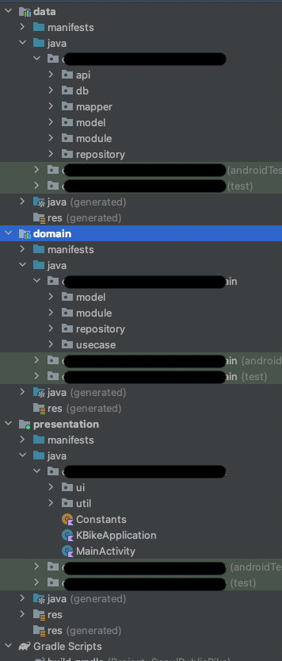
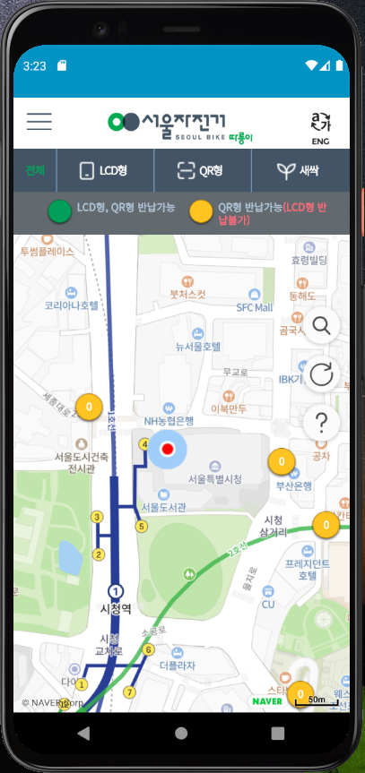

# K-자전거

한국 지자체에서 운영중인 공공 자전거 현황을 지도로 보여주는 애플리케이션  

K-자전거는 여러 지자체 공공자전거 페이지를 하나의 앱에서 볼 수 있도록 개발하였습니다!  
또한 지도와 위치 서비스를 통해 주변 시설 검색과 내비게이션 서비스를 이용할 수 있습니다! <r> 
  
개발인원 : 1명(개인 프로젝트)  
개발기간 : (2020.12 - 2021.02) 3개월. 출시 이후 지속적인 리팩토링 적용. 
사용 API : Naver Api, Kakao Api 
기술 스택 :  
Android Jetpack, AAC(ViewModel, LiveData, Binding, Navigation), Room 
Coroutine Flow, SQLite, DI(Hilt)  
  

  
자전거 여행을 좋아하는데 각 지자체별 공공자전거 앱이 너무 많아요.   
공공자전거 앱으로 예약은 할 수 있지만, 결국 내비게이션이나 지도 앱을 사용해야 돼요.  
K-Bike는 이러한 불편함을 해소하기 위해 하나의 앱에 이 서비스를 다 담았습니다.  
웹뷰를 지원하는 것은 물론이고, 주소 검색, 위치 검색, 내비게이션  
주변 편의시설 정보 또한 확인할 수 있습니다. 
  

