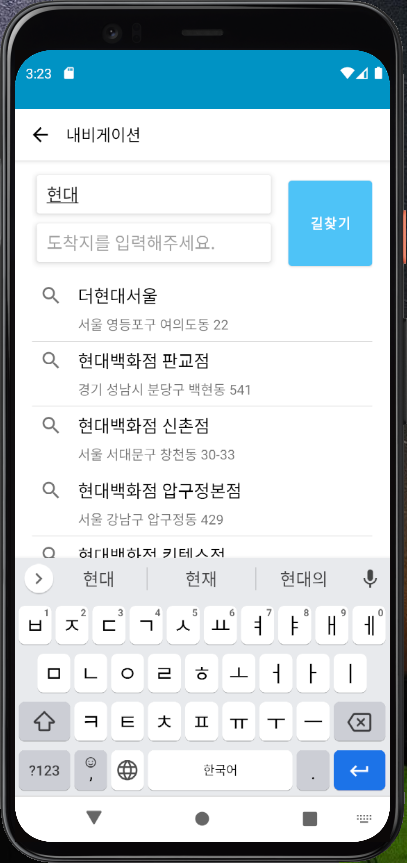

# K-자전거(서울시 공공 자전거 현황)

서울시 공공 자전거 현황을 지도로 보여주는 어플리케이션  

K-자전거는 저의 수준에 맞게 안드로이드 공식 문서 가이드 라인을 준수하며 개발하려고 노력하였습니다.  
서울시 공공 API, NAVER MAP API, 카카오 로컬 API 서비스를 사용하였습니다.   

 
네이버 지도에 공공데이터 자전거 대여소를 나타내는 마커가 표시됩니다.   
마커를 클릭할 경우 대여소 정보가  즐겨찾기 목록에 추가할 수 있습니다.  
녹색은 대여소, 파란색은 내 위치, 다른 색은 주변 편의시설을 의미합니다.  
주소 검색 기능으로 내 위치가 아닌 다른 위치 대여소 정보를 확인할 수 있고,  
주변 편의시설 정보 또한 확인할 수 있습니다.   

 
WebView를 활용하여 공공 API에서 제공하지 않는 기능과 실제 대여 및 결제를 앱 안에서 할 수 있도록 구현하였습니다.  
주소 검색 기능을 활용한 모습입니다.  
주소를 클릭하면 주소 좌표로 바로 이동하며 즐겨찾기 목록에 자동으로 추가됩니다.  
만약 위치 권한이 허용되지 않았다면 기본 값으로 적용되며 일부 기능을 이용할 수 없게 됩니다.  
Retrofit, ROOM, ViewModel, LiveData, Coroutine을 사용하였습니다.  
view binding, data binding을 적용하였습니다.
MVVM 패턴, Thread-safe한 코드를 위해 노력하였습니다.  
